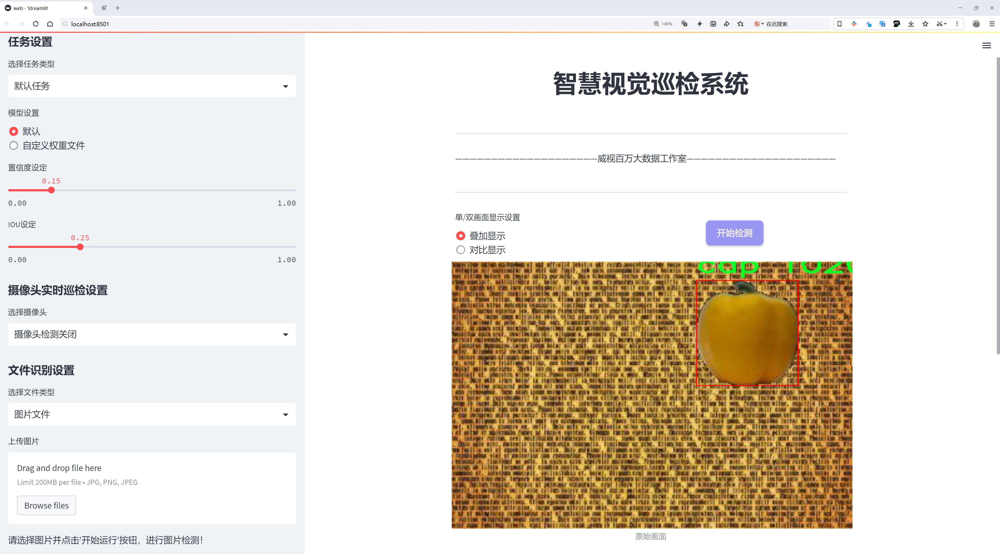
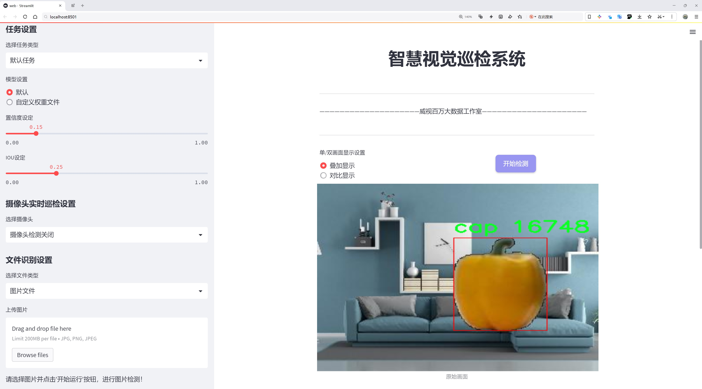
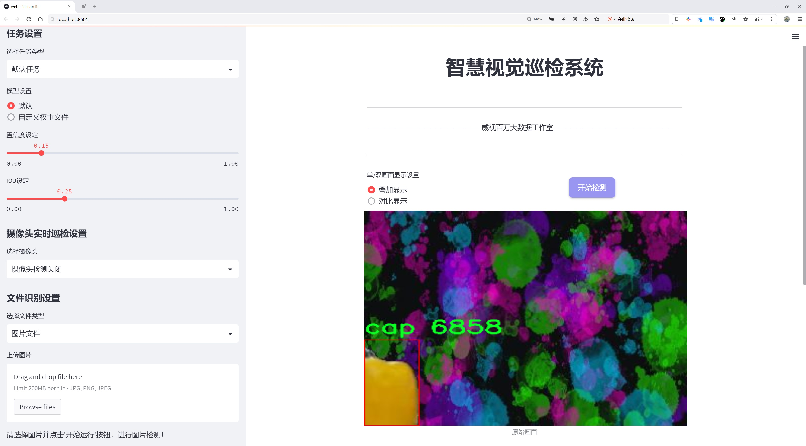
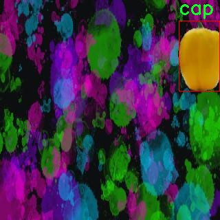
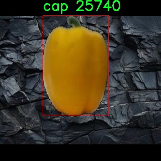
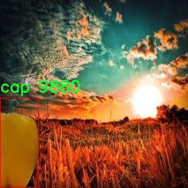
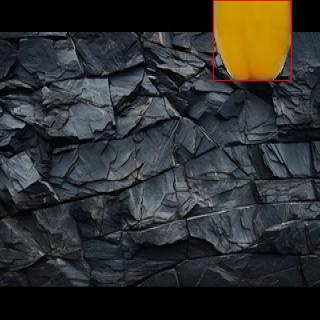
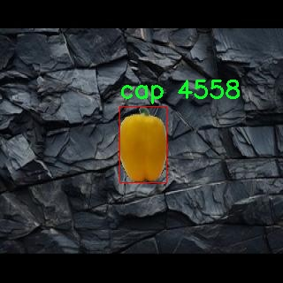

# 水果分类与检测检测系统源码分享
 # [一条龙教学YOLOV8标注好的数据集一键训练_70+全套改进创新点发刊_Web前端展示]

### 1.研究背景与意义

项目参考[AAAI Association for the Advancement of Artificial Intelligence](https://gitee.com/qunshansj/projects)

项目来源[AACV Association for the Advancement of Computer Vision](https://gitee.com/qunmasj/projects)

研究背景与意义

随着全球经济的快速发展和人们生活水平的不断提高，水果消费逐渐成为日常饮食中不可或缺的一部分。水果不仅富含营养，且具有丰富的品种和多样的口感，因而受到广泛欢迎。然而，水果的种类繁多，外观相似度高，传统的人工分类和检测方法不仅效率低下，而且容易出现错误。因此，基于计算机视觉和深度学习技术的水果分类与检测系统应运而生，成为提高水果产业效率和质量的重要工具。

近年来，目标检测技术的迅猛发展为水果分类与检测提供了新的解决方案。YOLO（You Only Look Once）系列模型以其快速、高效的特性，广泛应用于各种目标检测任务中。YOLOv8作为该系列的最新版本，结合了多种先进的深度学习技术，具有更高的准确性和更快的推理速度。通过对YOLOv8模型的改进，能够进一步提升其在水果分类与检测中的表现，使其更好地适应复杂的实际应用场景。

本研究所使用的数据集包含6100张图像，涵盖了7个水果类别，包括洋葱、蒜、柠檬、青柠、梨、南瓜和番茄。这些类别的选择不仅具有代表性，而且在市场上具有较高的需求。通过对这些水果进行分类与检测，不仅可以帮助商家提高库存管理效率，还可以为消费者提供更为准确的水果信息，从而提升购物体验。此外，数据集的多样性和丰富性为模型的训练和验证提供了良好的基础，确保了研究结果的可靠性和有效性。

在实际应用中，水果的分类与检测系统不仅可以应用于零售和批发市场，还可以在农业生产、物流运输等环节发挥重要作用。通过自动化的检测和分类，能够有效降低人工成本，提高工作效率，减少人为错误。同时，结合物联网技术，水果分类与检测系统还可以实现实时监控和数据分析，为农业决策提供科学依据。

本研究的意义在于，通过改进YOLOv8模型，构建一个高效、准确的水果分类与检测系统，不仅为水果产业的智能化发展提供技术支持，也为相关领域的研究提供新的思路和方法。随着技术的不断进步和应用场景的不断拓展，基于深度学习的水果分类与检测系统将会在未来的农业生产和市场流通中发挥越来越重要的作用，推动整个水果产业的转型升级。通过本研究的深入探索，有望为水果行业的数字化转型提供有力的技术支撑，助力实现更高效、更可持续的农业发展目标。

### 2.图片演示







##### 注意：由于此博客编辑较早，上面“2.图片演示”和“3.视频演示”展示的系统图片或者视频可能为老版本，新版本在老版本的基础上升级如下：（实际效果以升级的新版本为准）

  （1）适配了YOLOV8的“目标检测”模型和“实例分割”模型，通过加载相应的权重（.pt）文件即可自适应加载模型。

  （2）支持“图片识别”、“视频识别”、“摄像头实时识别”三种识别模式。

  （3）支持“图片识别”、“视频识别”、“摄像头实时识别”三种识别结果保存导出，解决手动导出（容易卡顿出现爆内存）存在的问题，识别完自动保存结果并导出到tempDir中。

  （4）支持Web前端系统中的标题、背景图等自定义修改，后面提供修改教程。

  另外本项目提供训练的数据集和训练教程,暂不提供权重文件（best.pt）,需要您按照教程进行训练后实现图片演示和Web前端界面演示的效果。

### 3.视频演示

[3.1 视频演示](https://www.bilibili.com/video/BV15mpxejEge/)

### 4.数据集信息展示

##### 4.1 本项目数据集详细数据（类别数＆类别名）

nc: 7
names: ['cap', 'garlic', 'lemon', 'lime', 'pear', 'pumpkin', 'tomato']


##### 4.2 本项目数据集信息介绍

数据集信息展示

在本研究中，我们使用了名为“5-8test”的数据集，以支持对YOLOv8模型的改进，旨在提升水果分类与检测系统的性能。该数据集专注于七种特定类别的水果和蔬菜，涵盖了多样的形态和特征，能够为模型的训练提供丰富的样本。这七个类别分别是：帽子（cap）、大蒜（garlic）、柠檬（lemon）、青柠（lime）、梨（pear）、南瓜（pumpkin）和西红柿（tomato）。每个类别都代表了不同的形状、颜色和纹理特征，极大地丰富了模型的学习基础。

数据集的构建过程经过精心设计，确保了每个类别的样本数量和质量。每种水果和蔬菜的图像均经过严格筛选，确保其在不同光照、角度和背景下的表现都能被有效捕捉。这种多样性不仅提高了模型的鲁棒性，还使其能够在实际应用中更好地适应不同的环境条件。例如，柠檬和青柠在色彩上有相似之处，但在形状和纹理上却存在显著差异，这要求模型能够精确地识别和区分它们。通过这种方式，数据集为模型提供了丰富的学习样本，使其能够在复杂的视觉任务中表现出色。

在数据集的标注过程中，采用了精确的边界框标注技术，确保每个图像中的目标物体都被准确地框定。这种精确的标注方式对于训练目标检测模型至关重要，因为它直接影响到模型的定位精度和分类性能。每个类别的标注信息都被系统化地记录，以便于后续的训练和验证过程。此外，数据集还包含了多种不同的背景和环境设置，使得模型在训练过程中能够学习到如何在各种条件下进行有效的目标检测。

为了确保模型的泛化能力，数据集中的样本还进行了适当的增强处理。这包括图像的旋转、缩放、裁剪和颜色调整等操作，以模拟不同的拍摄条件和视角。这种数据增强策略不仅增加了训练样本的多样性，还帮助模型更好地应对实际应用中可能遇到的各种情况。通过这些技术手段，数据集“5-8test”不仅为YOLOv8模型的训练提供了坚实的基础，也为后续的性能评估和优化奠定了良好的基础。

总之，数据集“5-8test”在水果分类与检测系统的训练中发挥了至关重要的作用。其丰富的类别设置、精确的标注方式以及多样化的样本特征，使得模型能够在复杂的视觉任务中实现高效的分类与检测。通过对该数据集的深入分析和利用，我们期待能够显著提升YOLOv8模型在水果及蔬菜识别领域的表现，为相关应用提供更为精准和可靠的解决方案。











### 5.全套项目环境部署视频教程（零基础手把手教学）

[5.1 环境部署教程链接（零基础手把手教学）](https://www.ixigua.com/7404473917358506534?logTag=c807d0cbc21c0ef59de5)


[5.2 安装Python虚拟环境创建和依赖库安装视频教程链接（零基础手把手教学）](https://www.ixigua.com/7404474678003106304?logTag=1f1041108cd1f708b01a)

### 6.手把手YOLOV8训练视频教程（零基础小白有手就能学会）

[6.1 手把手YOLOV8训练视频教程（零基础小白有手就能学会）](https://www.ixigua.com/7404477157818401292?logTag=d31a2dfd1983c9668658)

### 7.70+种全套YOLOV8创新点代码加载调参视频教程（一键加载写好的改进模型的配置文件）

[7.1 70+种全套YOLOV8创新点代码加载调参视频教程（一键加载写好的改进模型的配置文件）](https://www.ixigua.com/7404478314661806627?logTag=29066f8288e3f4eea3a4)

### 8.70+种全套YOLOV8创新点原理讲解（非科班也可以轻松写刊发刊，V10版本正在科研待更新）

由于篇幅限制，每个创新点的具体原理讲解就不一一展开，具体见下列网址中的创新点对应子项目的技术原理博客网址【Blog】：


[8.1 70+种全套YOLOV8创新点原理讲解链接](https://gitee.com/qunmasj/good)

### 9.系统功能展示（检测对象为举例，实际内容以本项目数据集为准）

图9.1.系统支持检测结果表格显示

  图9.2.系统支持置信度和IOU阈值手动调节

  图9.3.系统支持自定义加载权重文件best.pt(需要你通过步骤5中训练获得)

  图9.4.系统支持摄像头实时识别

  图9.5.系统支持图片识别

  图9.6.系统支持视频识别

  图9.7.系统支持识别结果文件自动保存

  图9.8.系统支持Excel导出检测结果数据


### 10.原始YOLOV8算法原理

原始YOLOv8算法原理

YOLOv8是YOLO系列中最新的目标检测算法，它在YOLOv7的基础上进行了多项创新和优化，旨在提升检测精度和速度。作为一种基于卷积神经网络的算法，YOLOv8将整个图像作为输入，直接在图像上进行目标检测和定位，避免了传统方法中滑动窗口或区域提议的复杂性。这种设计使得YOLOv8在处理速度和实时性方面具有显著优势，特别适合于需要快速响应的应用场景，如智能监控和自动驾驶。

YOLOv8的网络结构主要分为四个部分：输入端、骨干网络、颈部网络和头部网络。输入端的设计引入了马赛克数据增强、自适应锚框计算和自适应灰度填充等技术，以提高模型的鲁棒性和泛化能力。马赛克数据增强通过将多张图像拼接在一起，增加了训练样本的多样性，从而使模型能够更好地适应不同的场景。然而，YOLOv8在训练的最后阶段停止使用马赛克数据增强，以避免对数据真实分布的破坏。

在骨干网络方面，YOLOv8采用了C2f模块和SPPF（Spatial Pyramid Pooling Fusion）结构。C2f模块是YOLOv8的核心特征提取模块，它通过引入更多的分支跨层连接，增强了梯度流的丰富性，从而提升了特征表示能力。这一设计灵感来源于YOLOv7的ELAN结构，使得模型在保持轻量化的同时，能够更有效地学习复杂的特征。SPPF模块则在保留其原有效果的基础上，优化了执行时间，进一步提升了网络的整体性能。

颈部网络采用了路径聚合网络（PAN）结构，旨在加强对不同缩放尺度对象的特征融合能力。PAN通过有效地整合来自不同层次的特征信息，使得模型在处理多尺度目标时表现得更加出色。这一特性对于目标检测任务至关重要，因为现实场景中的目标往往具有不同的尺寸和形状。

头部网络是YOLOv8的一大创新之处，它将分类和检测过程进行了有效的解耦。传统的目标检测方法通常将分类和定位任务耦合在一起，而YOLOv8则采用了两条并行的分支，分别提取类别和位置特征。这种解耦结构使得模型在分类和定位任务中能够更专注于各自的目标，从而提高了收敛速度和预测精度。此外，YOLOv8引入了无锚框检测头，直接预测目标的中心位置，减少了锚框预测的数量，进而加速了非最大抑制（NMS）过程。

在损失计算方面，YOLOv8采用了Task-Aligned Assigner（TAL）策略，根据分类与回归的分数加权结果选择正样本。这一策略通过引入分类分数和IOU的高次幂乘积作为衡量任务对齐程度的指标，确保了模型在定位和分类方面的良好表现。分类分支使用二元交叉熵损失（BCELoss）进行训练，而回归分支则结合了分布焦点损失（DFLoss）和完全交并比损失函数（CIOULoss），以提升边界框预测的精准性。

YOLOv8的设计不仅关注于提高检测精度，同时也注重模型的轻量化和实时性。其不同尺寸的模型（如YOLOv8n、YOLOv8s、YOLOv8m、YOLOv8l和YOLOv8x）满足了不同应用场景的需求，其中YOLOv8n以最小的参数量和最快的检测速度脱颖而出。这使得YOLOv8在实际应用中能够更好地平衡精度与速度，尤其适合于需要实时处理的任务。

在实际应用中，YOLOv8在COCO数据集上的表现尤为突出，展示了其在多种目标检测任务中的优越性。与之前的YOLO系列模型相比，YOLOv8在相同模型尺寸下，参数量没有显著增加的情况下，取得了更高的mAP（mean Average Precision）值和更快的推理速度。这一成果不仅证明了YOLOv8在目标检测领域的领先地位，也为未来的研究和应用提供了广阔的前景。

综上所述，YOLOv8通过一系列创新的设计和优化，提升了目标检测的精度和速度，尤其是在处理复杂场景和多尺度目标时表现出色。其独特的网络结构和损失计算策略，使得YOLOv8成为当前目标检测领域的重要里程碑，具有广泛的应用价值和研究潜力。随着技术的不断进步，YOLOv8有望在更多实际应用中发挥重要作用，推动目标检测技术的进一步发展。


### 11.项目核心源码讲解（再也不用担心看不懂代码逻辑）

#### 11.1 ui.py

以下是代码的核心部分，并添加了详细的中文注释：

```python
import sys  # 导入sys模块，用于访问与Python解释器相关的变量和函数
import subprocess  # 导入subprocess模块，用于执行外部命令

def run_script(script_path):
    """
    使用当前 Python 环境运行指定的脚本。

    Args:
        script_path (str): 要运行的脚本路径

    Returns:
        None
    """
    # 获取当前 Python 解释器的路径
    python_path = sys.executable

    # 构建运行命令，使用streamlit运行指定的脚本
    command = f'"{python_path}" -m streamlit run "{script_path}"'

    # 执行命令
    result = subprocess.run(command, shell=True)  # 使用subprocess.run执行命令
    if result.returncode != 0:  # 检查命令执行是否成功
        print("脚本运行出错。")  # 如果返回码不为0，表示出错，打印错误信息

# 实例化并运行应用
if __name__ == "__main__":
    # 指定要运行的脚本路径
    script_path = "web.py"  # 这里直接指定脚本名，假设在当前目录下

    # 运行脚本
    run_script(script_path)  # 调用run_script函数执行指定的脚本
```

### 代码分析：
1. **模块导入**：
   - `sys`模块用于获取当前Python解释器的路径。
   - `subprocess`模块用于在Python中执行外部命令。

2. **`run_script`函数**：
   - 接受一个参数`script_path`，表示要运行的Python脚本的路径。
   - 使用`sys.executable`获取当前Python解释器的路径。
   - 构建一个命令字符串，用于调用`streamlit`来运行指定的脚本。
   - 使用`subprocess.run`执行构建的命令，并检查返回码以判断脚本是否成功运行。

3. **主程序入口**：
   - 在`__main__`模块中，指定要运行的脚本路径为`web.py`。
   - 调用`run_script`函数来执行该脚本。 

### 注意事项：
- 这里假设`web.py`脚本与当前运行的脚本在同一目录下。
- 该代码依赖于`streamlit`库，因此在运行之前需要确保已安装该库。

这个文件名为 `ui.py`，其主要功能是运行一个指定的 Python 脚本，具体是使用 Streamlit 框架来启动一个 Web 应用。代码的结构比较简单，主要由几个部分组成。

首先，文件导入了一些必要的模块，包括 `sys`、`os` 和 `subprocess`。`sys` 模块用于访问与 Python 解释器相关的变量和函数，`os` 模块提供了与操作系统交互的功能，而 `subprocess` 模块则用于执行外部命令。

接下来，代码定义了一个名为 `run_script` 的函数，该函数接受一个参数 `script_path`，表示要运行的脚本的路径。在函数内部，首先获取当前 Python 解释器的路径，这通过 `sys.executable` 实现。然后，构建一个命令字符串，使用当前的 Python 解释器和 Streamlit 来运行指定的脚本。具体的命令格式为 `"{python_path}" -m streamlit run "{script_path}"`。

之后，使用 `subprocess.run` 方法执行这个命令。该方法会在一个新的子进程中运行命令，并等待其完成。如果命令执行后返回的状态码不为零，表示脚本运行出错，此时会打印出一条错误信息。

在文件的最后部分，使用 `if __name__ == "__main__":` 语句来确保当该文件作为主程序运行时才会执行以下代码。这里指定了要运行的脚本路径为 `web.py`，这个路径是通过 `abs_path` 函数获取的，`abs_path` 函数的具体实现并未在此文件中展示，可能是在其他地方定义的，用于获取脚本的绝对路径。

最后，调用 `run_script` 函数来执行指定的脚本。整体来看，这个文件的作用是为运行一个基于 Streamlit 的 Web 应用提供一个简单的接口。

#### 11.2 70+种YOLOv8算法改进源码大全和调试加载训练教程（非必要）\ultralytics\models\yolo\pose\train.py

以下是经过简化和注释的核心代码部分：

```python
# 导入必要的库和模块
from copy import copy
from ultralytics.models import yolo
from ultralytics.nn.tasks import PoseModel
from ultralytics.utils import DEFAULT_CFG, LOGGER
from ultralytics.utils.plotting import plot_images, plot_results

class PoseTrainer(yolo.detect.DetectionTrainer):
    """
    PoseTrainer类用于基于姿态模型进行训练，继承自DetectionTrainer类。
    """

    def __init__(self, cfg=DEFAULT_CFG, overrides=None, _callbacks=None):
        """初始化PoseTrainer对象，设置配置和覆盖参数。"""
        if overrides is None:
            overrides = {}
        overrides['task'] = 'pose'  # 设置任务类型为姿态估计
        super().__init__(cfg, overrides, _callbacks)  # 调用父类构造函数

        # 针对Apple MPS设备的警告
        if isinstance(self.args.device, str) and self.args.device.lower() == 'mps':
            LOGGER.warning("WARNING ⚠️ Apple MPS known Pose bug. Recommend 'device=cpu' for Pose models.")

    def get_model(self, cfg=None, weights=None, verbose=True):
        """获取姿态估计模型，指定配置和权重。"""
        # 创建PoseModel实例
        model = PoseModel(cfg, ch=3, nc=self.data['nc'], data_kpt_shape=self.data['kpt_shape'], verbose=verbose)
        if weights:
            model.load(weights)  # 加载权重

        return model  # 返回模型

    def set_model_attributes(self):
        """设置PoseModel的关键点形状属性。"""
        super().set_model_attributes()  # 调用父类方法
        self.model.kpt_shape = self.data['kpt_shape']  # 设置关键点形状

    def get_validator(self):
        """返回PoseValidator类的实例，用于验证。"""
        self.loss_names = 'box_loss', 'pose_loss', 'kobj_loss', 'cls_loss', 'dfl_loss'  # 定义损失名称
        return yolo.pose.PoseValidator(self.test_loader, save_dir=self.save_dir, args=copy(self.args))  # 返回验证器实例

    def plot_training_samples(self, batch, ni):
        """绘制一批训练样本，包括类标签、边界框和关键点。"""
        images = batch['img']  # 获取图像
        kpts = batch['keypoints']  # 获取关键点
        cls = batch['cls'].squeeze(-1)  # 获取类标签
        bboxes = batch['bboxes']  # 获取边界框
        paths = batch['im_file']  # 获取图像文件路径
        batch_idx = batch['batch_idx']  # 获取批次索引
        # 绘制图像
        plot_images(images,
                    batch_idx,
                    cls,
                    bboxes,
                    kpts=kpts,
                    paths=paths,
                    fname=self.save_dir / f'train_batch{ni}.jpg',  # 保存文件名
                    on_plot=self.on_plot)  # 是否在绘图上显示

    def plot_metrics(self):
        """绘制训练和验证的指标。"""
        plot_results(file=self.csv, pose=True, on_plot=self.on_plot)  # 保存结果图像
```

### 代码说明：
1. **PoseTrainer类**：这是一个用于姿态估计的训练类，继承自YOLO的检测训练器。
2. **初始化方法**：设置任务类型为姿态估计，并处理设备警告。
3. **获取模型**：创建并返回一个姿态模型实例，可以选择加载预训练权重。
4. **设置模型属性**：设置模型的关键点形状属性。
5. **获取验证器**：返回一个用于验证的PoseValidator实例，并定义损失名称。
6. **绘制训练样本**：将一批训练样本的图像、关键点和边界框绘制出来，并保存为图像文件。
7. **绘制指标**：绘制训练和验证过程中的指标图。

该程序文件是一个用于训练基于姿态模型的YOLOv8算法的Python脚本，属于Ultralytics YOLO项目的一部分。文件中定义了一个名为`PoseTrainer`的类，该类继承自`DetectionTrainer`，专门用于姿态估计任务。

在`PoseTrainer`类的构造函数中，首先初始化了一些配置参数。如果没有提供覆盖参数，则使用默认值，并将任务类型设置为“pose”。在设备选择方面，如果用户选择了Apple的MPS设备，程序会发出警告，建议使用CPU进行姿态模型的训练，以避免已知的兼容性问题。

`get_model`方法用于获取姿态估计模型。它接受配置和权重参数，并创建一个`PoseModel`实例。如果提供了权重，则会加载这些权重。这个方法确保模型根据指定的配置和数据集的关键点形状进行初始化。

`set_model_attributes`方法用于设置模型的关键点形状属性，确保模型能够正确处理输入数据的格式。

`get_validator`方法返回一个`PoseValidator`实例，用于模型验证。它定义了损失名称，包括边界框损失、姿态损失、关键点对象损失、类别损失和分布损失。

`plot_training_samples`方法用于可视化一批训练样本，包括图像、关键点、类别标签和边界框。它会将这些信息绘制到一张图像上，并保存到指定的目录中。

最后，`plot_metrics`方法用于绘制训练和验证过程中的指标，生成的结果会保存为图像文件，以便后续分析。

整体来看，这个文件提供了一个完整的框架，用于训练和验证YOLOv8姿态估计模型，涵盖了模型初始化、训练样本可视化和性能指标绘制等功能。

#### 11.3 code\ultralytics\trackers\track.py

以下是代码中最核心的部分，并附上详细的中文注释：

```python
# 导入必要的库
from functools import partial
from pathlib import Path
import torch
from ultralytics.utils import IterableSimpleNamespace, yaml_load
from ultralytics.utils.checks import check_yaml
from .bot_sort import BOTSORT
from .byte_tracker import BYTETracker

# 跟踪器类型与对应的跟踪器类的映射
TRACKER_MAP = {"bytetrack": BYTETracker, "botsort": BOTSORT}

def on_predict_start(predictor: object, persist: bool = False) -> None:
    """
    在预测开始时初始化对象跟踪器。

    参数:
        predictor (object): 用于初始化跟踪器的预测器对象。
        persist (bool, optional): 如果跟踪器已经存在，是否保持其状态。默认为 False。

    异常:
        AssertionError: 如果 tracker_type 不是 'bytetrack' 或 'botsort'。
    """
    # 检查任务类型是否为 OBB（方向边界框），如果是则抛出异常
    if predictor.args.task == "obb":
        raise NotImplementedError("ERROR ❌ OBB task does not support track mode!")
    
    # 如果预测器已经有跟踪器并且选择保持状态，则直接返回
    if hasattr(predictor, "trackers") and persist:
        return

    # 检查并加载跟踪器的配置文件
    tracker = check_yaml(predictor.args.tracker)
    cfg = IterableSimpleNamespace(**yaml_load(tracker))

    # 检查跟踪器类型是否有效
    if cfg.tracker_type not in ["bytetrack", "botsort"]:
        raise AssertionError(f"Only 'bytetrack' and 'botsort' are supported for now, but got '{cfg.tracker_type}'")

    # 初始化跟踪器列表
    trackers = []
    for _ in range(predictor.dataset.bs):  # 根据批次大小创建跟踪器
        tracker = TRACKER_MAP[cfg.tracker_type](args=cfg, frame_rate=30)
        trackers.append(tracker)
    
    # 将创建的跟踪器分配给预测器
    predictor.trackers = trackers

def on_predict_postprocess_end(predictor: object, persist: bool = False) -> None:
    """
    后处理检测到的框并更新对象跟踪。

    参数:
        predictor (object): 包含预测结果的预测器对象。
        persist (bool, optional): 如果跟踪器已经存在，是否保持其状态。默认为 False。
    """
    bs = predictor.dataset.bs  # 批次大小
    path, im0s = predictor.batch[:2]  # 获取路径和图像

    for i in range(bs):
        # 如果不是保持状态且视频路径不同，则重置跟踪器
        if not persist and predictor.vid_path[i] != str(predictor.save_dir / Path(path[i]).name):  # 新视频
            predictor.trackers[i].reset()

        det = predictor.results[i].boxes.cpu().numpy()  # 获取检测到的框
        if len(det) == 0:  # 如果没有检测到框，则跳过
            continue
        
        # 更新跟踪器并获取跟踪结果
        tracks = predictor.trackers[i].update(det, im0s[i])
        if len(tracks) == 0:  # 如果没有跟踪结果，则跳过
            continue
        
        idx = tracks[:, -1].astype(int)  # 获取跟踪的索引
        predictor.results[i] = predictor.results[i][idx]  # 更新预测结果
        predictor.results[i].update(boxes=torch.as_tensor(tracks[:, :-1]))  # 更新框信息

def register_tracker(model: object, persist: bool) -> None:
    """
    为模型注册跟踪回调，以便在预测期间进行对象跟踪。

    参数:
        model (object): 要注册跟踪回调的模型对象。
        persist (bool): 如果跟踪器已经存在，是否保持其状态。
    """
    # 添加预测开始时的回调
    model.add_callback("on_predict_start", partial(on_predict_start, persist=persist))
    # 添加后处理结束时的回调
    model.add_callback("on_predict_postprocess_end", partial(on_predict_postprocess_end, persist=persist))
```

### 代码说明：
1. **导入模块**：引入了必要的库和模块，包括用于处理路径的 `Path`、用于张量计算的 `torch` 以及 YOLO 相关的工具。
2. **跟踪器映射**：定义了一个字典 `TRACKER_MAP`，将跟踪器类型映射到具体的跟踪器类。
3. **`on_predict_start` 函数**：在预测开始时初始化跟踪器，检查任务类型和跟踪器配置，并根据批次大小创建相应数量的跟踪器。
4. **`on_predict_postprocess_end` 函数**：在预测后处理结束时更新检测框和跟踪结果，处理每个视频帧的跟踪逻辑。
5. **`register_tracker` 函数**：为模型注册跟踪相关的回调函数，以便在预测过程中能够正确地初始化和更新跟踪器。

这个程序文件是用于实现目标跟踪功能的，主要依赖于Ultralytics YOLO框架。文件中定义了一些函数和类，主要用于在预测过程中初始化和管理目标跟踪器。

首先，文件导入了一些必要的库和模块，包括`torch`、`pathlib`以及Ultralytics的一些工具函数和类。它还定义了一个`TRACKER_MAP`字典，用于将跟踪器类型映射到相应的跟踪器类，如`BYTETracker`和`BOTSORT`。

接下来，定义了`on_predict_start`函数，该函数在预测开始时被调用。它的主要作用是初始化目标跟踪器。如果传入的`predictor`对象的任务类型是“obb”，则会抛出一个未实现的错误，因为该任务不支持跟踪模式。如果`predictor`对象已经有跟踪器并且`persist`参数为真，则直接返回。函数会检查跟踪器的配置文件，确保其类型是“bytetrack”或“botsort”，否则会抛出一个断言错误。然后，根据批次大小创建相应数量的跟踪器实例，并将其存储在`predictor.trackers`中。

接着，定义了`on_predict_postprocess_end`函数，该函数在预测后处理结束时被调用。它的主要功能是对检测到的目标框进行后处理，并更新目标跟踪信息。函数首先获取批次大小和输入图像。然后，对于每个视频帧，如果`persist`为假且当前视频路径与保存路径不同，则重置相应的跟踪器。接下来，获取检测结果，如果没有检测到目标，则跳过处理。对于检测到的目标，调用相应的跟踪器进行更新，并根据跟踪结果更新预测结果。

最后，定义了`register_tracker`函数，该函数用于将跟踪回调注册到模型中，以便在预测过程中使用。它通过`model.add_callback`方法将`on_predict_start`和`on_predict_postprocess_end`函数注册为回调函数，并传入`persist`参数。

整体来看，这个文件的主要目的是为Ultralytics YOLO模型提供目标跟踪的功能，通过初始化和管理跟踪器，确保在视频分析过程中能够有效地跟踪目标。

#### 11.4 train.py

以下是经过简化和注释的核心代码部分：

```python
import random
import numpy as np
import torch.nn as nn
from ultralytics.data import build_dataloader, build_yolo_dataset
from ultralytics.engine.trainer import BaseTrainer
from ultralytics.models import yolo
from ultralytics.nn.tasks import DetectionModel
from ultralytics.utils import LOGGER, RANK
from ultralytics.utils.torch_utils import de_parallel, torch_distributed_zero_first

class DetectionTrainer(BaseTrainer):
    """
    基于检测模型的训练类，继承自BaseTrainer类。
    """

    def build_dataset(self, img_path, mode="train", batch=None):
        """
        构建YOLO数据集。

        参数:
            img_path (str): 包含图像的文件夹路径。
            mode (str): 模式，可以是'train'或'val'，用于自定义不同的增强方式。
            batch (int, optional): 批次大小，仅用于'rect'模式。默认为None。
        """
        gs = max(int(de_parallel(self.model).stride.max() if self.model else 0), 32)
        return build_yolo_dataset(self.args, img_path, batch, self.data, mode=mode, rect=mode == "val", stride=gs)

    def get_dataloader(self, dataset_path, batch_size=16, rank=0, mode="train"):
        """构造并返回数据加载器。"""
        assert mode in ["train", "val"]
        with torch_distributed_zero_first(rank):  # 在分布式环境中，确保数据集只初始化一次
            dataset = self.build_dataset(dataset_path, mode, batch_size)
        shuffle = mode == "train"  # 训练模式下打乱数据
        workers = self.args.workers if mode == "train" else self.args.workers * 2
        return build_dataloader(dataset, batch_size, workers, shuffle, rank)  # 返回数据加载器

    def preprocess_batch(self, batch):
        """对图像批次进行预处理，包括缩放和转换为浮点数。"""
        batch["img"] = batch["img"].to(self.device, non_blocking=True).float() / 255  # 归一化到[0, 1]
        if self.args.multi_scale:  # 如果启用多尺度训练
            imgs = batch["img"]
            sz = (
                random.randrange(self.args.imgsz * 0.5, self.args.imgsz * 1.5 + self.stride)
                // self.stride
                * self.stride
            )  # 随机选择图像大小
            sf = sz / max(imgs.shape[2:])  # 计算缩放因子
            if sf != 1:
                ns = [
                    math.ceil(x * sf / self.stride) * self.stride for x in imgs.shape[2:]
                ]  # 计算新的形状
                imgs = nn.functional.interpolate(imgs, size=ns, mode="bilinear", align_corners=False)  # 进行插值
            batch["img"] = imgs
        return batch

    def get_model(self, cfg=None, weights=None, verbose=True):
        """返回YOLO检测模型。"""
        model = DetectionModel(cfg, nc=self.data["nc"], verbose=verbose and RANK == -1)
        if weights:
            model.load(weights)  # 加载权重
        return model

    def plot_training_samples(self, batch, ni):
        """绘制训练样本及其注释。"""
        plot_images(
            images=batch["img"],
            batch_idx=batch["batch_idx"],
            cls=batch["cls"].squeeze(-1),
            bboxes=batch["bboxes"],
            paths=batch["im_file"],
            fname=self.save_dir / f"train_batch{ni}.jpg",
            on_plot=self.on_plot,
        )

    def plot_metrics(self):
        """从CSV文件中绘制指标。"""
        plot_results(file=self.csv, on_plot=self.on_plot)  # 保存结果图
```

### 代码注释说明：
1. **导入模块**：导入必要的库和模块，包括PyTorch、YOLO相关的工具和数据处理模块。
2. **DetectionTrainer类**：定义了一个用于训练YOLO检测模型的类，继承自`BaseTrainer`。
3. **build_dataset方法**：构建YOLO数据集，支持训练和验证模式。
4. **get_dataloader方法**：创建数据加载器，支持分布式训练，确保数据集只初始化一次。
5. **preprocess_batch方法**：对输入的图像批次进行预处理，包括归一化和可选的多尺度调整。
6. **get_model方法**：返回一个YOLO检测模型，可以选择加载预训练权重。
7. **plot_training_samples方法**：绘制训练样本及其标注，便于可视化训练过程。
8. **plot_metrics方法**：从CSV文件中绘制训练指标，便于分析模型性能。

这个程序文件 `train.py` 是一个用于训练 YOLO（You Only Look Once）目标检测模型的实现，继承自 `BaseTrainer` 类。程序的主要功能是构建数据集、创建数据加载器、预处理图像批次、设置模型属性、获取模型、进行模型验证、记录损失、显示训练进度、绘制训练样本和指标等。

首先，程序导入了必要的库和模块，包括数学运算、随机数生成、深度学习相关的库（如 PyTorch）以及 Ultralytics 提供的各种工具和模型。接着定义了 `DetectionTrainer` 类，该类专门用于处理目标检测任务。

在 `build_dataset` 方法中，程序根据传入的图像路径和模式（训练或验证）构建 YOLO 数据集。它会根据模型的步幅计算合适的图像大小，并调用 `build_yolo_dataset` 函数来创建数据集。

`get_dataloader` 方法用于构建数据加载器，确保在分布式训练中只初始化一次数据集，并根据模式设置是否打乱数据顺序。该方法还会根据训练或验证模式调整工作线程的数量。

`preprocess_batch` 方法负责对图像批次进行预处理，包括将图像缩放到合适的大小并转换为浮点数格式。该方法支持多尺度训练，通过随机选择图像大小来增强模型的鲁棒性。

`set_model_attributes` 方法用于设置模型的属性，包括类别数量和类别名称等。它确保模型能够正确处理特定数据集的类别信息。

`get_model` 方法返回一个 YOLO 检测模型的实例，并可以加载预训练权重。`get_validator` 方法则返回一个用于模型验证的 `DetectionValidator` 实例，以便在训练过程中评估模型性能。

`label_loss_items` 方法用于返回带有标签的训练损失项字典，方便记录和分析训练过程中的损失情况。

`progress_string` 方法生成一个格式化的字符串，用于显示训练进度，包括当前的 epoch、GPU 内存使用情况、损失值、实例数量和图像大小等信息。

`plot_training_samples` 方法用于绘制训练样本及其标注，便于可视化训练数据的质量。`plot_metrics` 方法则从 CSV 文件中绘制训练指标，生成结果图像。最后，`plot_training_labels` 方法创建一个带标签的训练图，展示模型在训练数据上的表现。

整体来看，这个文件实现了 YOLO 模型训练的核心功能，涵盖了数据处理、模型构建、训练过程监控和结果可视化等多个方面，为用户提供了一个完整的训练框架。

#### 11.5 code\ultralytics\utils\errors.py

```python
# 导入emojis工具，用于处理带有表情符号的消息
from ultralytics.utils import emojis

# 自定义异常类，用于处理与Ultralytics YOLO模型获取相关的错误
class HUBModelError(Exception):
    """
    自定义异常类，用于处理与模型获取相关的错误。

    当请求的模型未找到或无法检索时，将引发此异常。
    消息会经过处理，以便更好地为用户体验添加表情符号。

    属性:
        message (str): 当异常被引发时显示的错误消息。
    """

    def __init__(self, message="Model not found. Please check model URL and try again."):
        """当模型未找到时创建异常。"""
        # 调用父类的构造函数，并使用emojis函数处理消息
        super().__init__(emojis(message))
``` 

### 代码核心部分及注释说明：
1. **异常类的定义**：`HUBModelError`类继承自`Exception`，用于表示特定的错误情况，即模型未找到的情况。
2. **构造函数**：`__init__`方法接受一个可选的错误消息参数，默认消息为“模型未找到，请检查模型URL并重试。”。该消息在初始化时通过`emojis`函数处理，以增强用户体验。
3. **属性说明**：类文档字符串详细说明了异常的用途和属性，帮助用户理解该异常的使用场景。

这个程序文件定义了一个自定义异常类 `HUBModelError`，用于处理与 Ultralytics YOLO 模型获取相关的错误。该异常类继承自 Python 的内置 `Exception` 类。

在类的文档字符串中，说明了该异常的用途：当请求的模型未找到或无法被检索时，会引发此异常。异常消息经过处理，包含了表情符号，以提升用户体验。

`HUBModelError` 类有一个初始化方法 `__init__`，它接受一个可选的参数 `message`，默认值为 "Model not found. Please check model URL and try again."。这个消息会被传递给父类的构造函数，并通过 `ultralytics.utils` 包中的 `emojis` 函数进行处理，以便在显示时能够包含表情符号。

总的来说，这个文件的主要功能是提供一个更友好的错误处理机制，以便在模型获取失败时能够给用户提供清晰的反馈。

#### 11.6 70+种YOLOv8算法改进源码大全和调试加载训练教程（非必要）\ultralytics\engine\trainer.py

以下是经过简化和注释的核心代码部分，主要保留了训练模型的关键逻辑和结构。

```python
class BaseTrainer:
    """
    BaseTrainer类是用于训练模型的基础类。
    包含模型训练的配置、数据集、优化器等重要信息。
    """

    def __init__(self, cfg=DEFAULT_CFG, overrides=None, _callbacks=None):
        """
        初始化BaseTrainer类。

        参数:
            cfg (str, optional): 配置文件路径，默认为DEFAULT_CFG。
            overrides (dict, optional): 配置覆盖，默认为None。
        """
        self.args = get_cfg(cfg, overrides)  # 获取配置
        self.check_resume(overrides)  # 检查是否需要从上次训练恢复
        self.device = select_device(self.args.device, self.args.batch)  # 选择训练设备
        self.model = None  # 模型实例
        self.trainset, self.testset = None, None  # 训练和测试数据集
        self.best_fitness = None  # 最佳适应度
        self.loss = None  # 当前损失
        self.csv = self.save_dir / 'results.csv'  # 结果CSV文件路径

        # 初始化模型和数据集
        self.setup_model()  # 设置模型
        self.trainset, self.testset = self.get_dataset(self.args.data)  # 获取数据集

    def train(self):
        """开始训练过程。"""
        world_size = self.get_world_size()  # 获取世界大小（即GPU数量）
        if world_size > 1:  # 如果使用多GPU训练
            self._setup_ddp(world_size)  # 设置分布式数据并行
        self._setup_train(world_size)  # 设置训练参数

        for epoch in range(self.start_epoch, self.epochs):  # 遍历每个epoch
            self.run_callbacks('on_train_epoch_start')  # 运行epoch开始的回调
            self.model.train()  # 设置模型为训练模式
            for i, batch in enumerate(self.train_loader):  # 遍历训练数据
                self.run_callbacks('on_train_batch_start')  # 运行每个batch开始的回调
                self.loss = self.model(batch)  # 前向传播计算损失
                self.optimizer_step()  # 优化器步骤
                self.run_callbacks('on_train_batch_end')  # 运行每个batch结束的回调

            self.run_callbacks('on_train_epoch_end')  # 运行epoch结束的回调

    def optimizer_step(self):
        """执行优化器的单步更新。"""
        self.scaler.unscale_(self.optimizer)  # 反缩放梯度
        torch.nn.utils.clip_grad_norm_(self.model.parameters(), max_norm=10.0)  # 梯度裁剪
        self.scaler.step(self.optimizer)  # 更新优化器
        self.scaler.update()  # 更新缩放器
        self.optimizer.zero_grad()  # 清零梯度

    def setup_model(self):
        """加载或创建模型。"""
        if isinstance(self.model, torch.nn.Module):  # 如果模型已经加载
            return
        # 加载模型逻辑
        self.model = self.get_model(cfg=self.args.model)  # 获取模型

    def get_world_size(self):
        """获取当前使用的GPU数量。"""
        if isinstance(self.args.device, str):
            return len(self.args.device.split(','))
        return 1  # 默认返回1

    def get_dataset(self, data):
        """从数据字典中获取训练和验证路径。"""
        return data['train'], data.get('val') or data.get('test')

    def run_callbacks(self, event: str):
        """运行与特定事件相关的所有回调。"""
        for callback in self.callbacks.get(event, []):
            callback(self)

    # 其他方法省略...
```

### 代码说明
1. **BaseTrainer类**：这是一个基础训练类，包含了训练所需的配置、模型、数据集和优化器等信息。
2. **初始化方法**：在初始化时，获取配置，检查是否需要恢复训练，选择设备，并设置模型和数据集。
3. **train方法**：这是训练的主要逻辑，包含了epoch的循环和batch的处理。
4. **optimizer_step方法**：执行优化器的更新步骤，包括反缩放梯度和梯度裁剪。
5. **setup_model方法**：用于加载或创建模型。
6. **get_world_size方法**：获取当前使用的GPU数量。
7. **get_dataset方法**：从数据字典中获取训练和验证数据集的路径。
8. **run_callbacks方法**：用于执行与特定事件相关的回调函数。 

以上代码保留了训练的核心逻辑，并添加了详细的中文注释以帮助理解。

这个程序文件是一个用于训练YOLOv8模型的基础类`BaseTrainer`，它包含了模型训练的各个方面，包括数据加载、模型设置、优化器配置、训练过程控制等。文件开头包含了使用说明，指明了如何通过命令行启动训练。

首先，文件导入了一系列必要的库，包括数学计算、文件操作、时间处理、深度学习框架PyTorch及其相关模块。接着，定义了`BaseTrainer`类，作为训练器的基类，包含了一些重要的属性和方法。

在类的初始化方法中，首先通过`get_cfg`函数获取配置参数，并检查是否需要从上次的检查点恢复训练。然后，选择设备（CPU或GPU）并初始化随机种子。接下来，创建保存结果和权重的目录，并保存配置参数到YAML文件中。

模型和数据集的加载是通过`check_cls_dataset`和`check_det_dataset`等函数进行的，确保数据集格式正确。训练集和测试集通过`get_dataset`方法获取。之后，初始化了一些优化相关的变量，包括损失函数、学习率调度器等。

`train`方法是训练的入口，首先确定使用的设备数量，如果是多GPU训练，则会生成相应的命令并通过子进程运行。否则，直接调用`_do_train`方法进行训练。

`_setup_ddp`和`_setup_train`方法用于设置分布式数据并行（DDP）训练的参数和数据加载器、优化器等。训练过程中，模型会根据设定的批量大小和学习率进行训练，并在每个epoch结束时进行验证。

在训练的每个batch中，首先进行前向传播计算损失，然后进行反向传播和优化步骤。训练过程中会记录损失和其他指标，并在指定的条件下保存模型的检查点。

文件还包含了一些辅助方法，如`save_model`用于保存模型的状态，`validate`用于在验证集上评估模型性能，`build_optimizer`用于构建优化器等。

总的来说，这个文件实现了YOLOv8模型训练的核心逻辑，涵盖了从数据准备到模型训练、验证和保存的完整流程，具有良好的模块化设计，便于扩展和维护。

### 12.系统整体结构（节选）

### 整体功能和构架概括

该程序是一个完整的目标检测和姿态估计框架，基于YOLOv8模型实现。它包含了模型训练、验证、目标跟踪、错误处理、数据集管理等多个模块，提供了一个灵活且高效的工具集，适用于计算机视觉任务。整体架构分为几个主要部分：

1. **用户界面（UI）**：通过`ui.py`文件提供了一个简单的界面，用于启动和运行YOLOv8模型的训练。
2. **模型训练**：`train.py`和`trainer.py`文件负责模型的训练过程，包括数据加载、模型初始化、损失计算和优化等。
3. **目标跟踪**：`track.py`文件实现了目标跟踪的功能，能够在视频流中实时跟踪目标。
4. **错误处理**：`errors.py`文件定义了自定义异常类，用于处理模型获取时的错误。
5. **数据处理**：多个文件负责数据集的管理和处理，包括数据集的构建、分割和预处理等。

### 文件功能整理表

| 文件路径                                                                                       | 功能描述                                                     |
|------------------------------------------------------------------------------------------------|------------------------------------------------------------|
| `D:\tools\20240809\code\ui.py`                                                                | 提供用户界面，通过Streamlit启动YOLOv8模型的训练。         |
| `D:\tools\20240809\code\70+种YOLOv8算法改进源码大全和调试加载训练教程（非必要）\ultralytics\models\yolo\pose\train.py` | 实现YOLOv8姿态估计模型的训练，包含数据集构建和验证。      |
| `D:\tools\20240809\code\code\ultralytics\trackers\track.py`                                 | 实现目标跟踪功能，管理和初始化目标跟踪器。                |
| `D:\tools\20240809\code\train.py`                                                            | 负责YOLOv8模型的训练过程，包括数据加载和模型优化。       |
| `D:\tools\20240809\code\code\ultralytics\utils\errors.py`                                   | 定义自定义异常类`HUBModelError`，用于处理模型获取错误。   |
| `D:\tools\20240809\code\70+种YOLOv8算法改进源码大全和调试加载训练教程（非必要）\ultralytics\engine\trainer.py` | 提供训练器基类`BaseTrainer`，实现训练的核心逻辑。         |
| `D:\tools\20240809\code\70+种YOLOv8算法改进源码大全和调试加载训练教程（非必要）\ultralytics\nn\__init__.py` | 初始化神经网络模块，可能包含模型定义和构建。              |
| `D:\tools\20240809\code\70+种YOLOv8算法改进源码大全和调试加载训练教程（非必要）\ultralytics\models\fastsam\__init__.py` | 初始化FastSAM模型模块，可能涉及模型的定义和加载。        |
| `D:\tools\20240809\code\code\ultralytics\models\fastsam\__init__.py`                       | 初始化FastSAM模型模块，可能涉及模型的定义和加载。        |
| `D:\tools\20240809\code\code\ultralytics\utils\callbacks\comet.py`                         | 实现与Comet.ml的集成，用于实验跟踪和可视化。               |
| `D:\tools\20240809\code\70+种YOLOv8算法改进源码大全和调试加载训练教程（非必要）\ultralytics\models\fastsam\prompt.py` | 处理FastSAM模型的提示和输入数据，可能涉及数据预处理。     |
| `D:\tools\20240809\code\code\ultralytics\data\split_dota.py`                               | 处理DOTA数据集的分割和管理，可能用于数据集的构建。        |
| `D:\tools\20240809\code\code\ultralytics\models\yolo\model.py`                             | 定义YOLO模型的结构和前向传播逻辑，包含模型的构建和配置。  |

这个表格概述了每个文件的主要功能，展示了该程序的模块化设计和功能分布。

注意：由于此博客编辑较早，上面“11.项目核心源码讲解（再也不用担心看不懂代码逻辑）”中部分代码可能会优化升级，仅供参考学习，完整“训练源码”、“Web前端界面”和“70+种创新点源码”以“13.完整训练+Web前端界面+70+种创新点源码、数据集获取”的内容为准。

### 13.完整训练+Web前端界面+70+种创新点源码、数据集获取


# [下载链接：https://mbd.pub/o/bread/ZpuTl5Zs](https://mbd.pub/o/bread/ZpuTl5Zs)